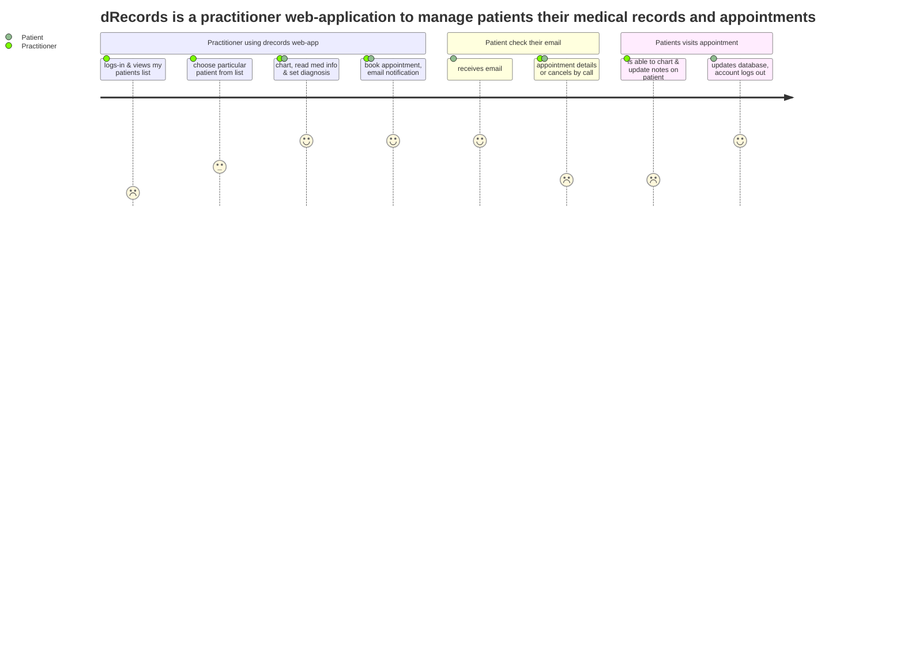
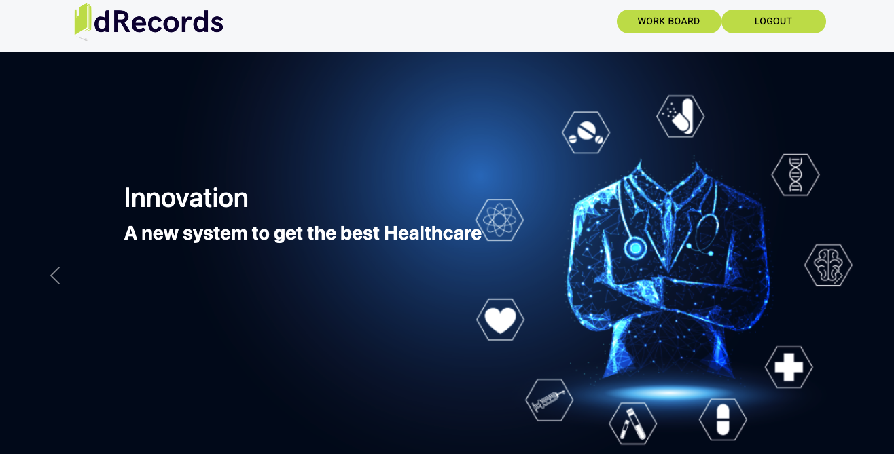

# dRecords

**Project Description**
An online charting application allowing healthcare providers to access patient information and schedule follow-up appointments efficiently. The user can keep track of old entries and register new ones upon a change in the patient's condition. An integrated calendar allows the user to plan tasks and keep track of upcoming events.

**Problem Statement**
Currently, there are few universal tools that allow for charting, diagnosis, medical history, and appointment all on one platform, which leads to greater effort on practitioner and time consumption. To solve the inefficiencies there should be a uniform portal allowing for all of these procedures to happen in one place.

**Solution and Product**
Projects’ value proposition is to allow the practitioner to perform all these functions resulting in a greater time savings and convenience, freeing up their time to allow for actual healthcare rather than administrative duties. Now Valentin will demonstrate our application.

**Target audience:** Healthcare providers looking for an effective way of documenting their diagnosis and notes as well as keeping track of patients.

## User Diagram with Mermaid

## Running the project

You need TWO terminal windows/tabs for this.

- Clone the repository onto your local device.
- Install dependencies using the `npm install` command in the client folder.
- Start the web server using the `npm start` command.
The app will be served at <http://localhost:3000/>
- Go to <http://localhost:3000/> in your browser.
- Install dependencies using the `npm install` command in the server folder.
- Start the web server using the `npm start` command.
- Set up psql by creating Data Base and copying the env.example file in the env.file
- Create API Key with SendGrid (https://sendgrid.com) and add it to .env file in order to be able to send email notification after an appointment is created

## Pictures

*Main Page*

## Dependencies
- nodeJS
- expressJS
- axios
- react
- react-router
- bcrypt
- mui
- kalend
- nodemon
- cors

